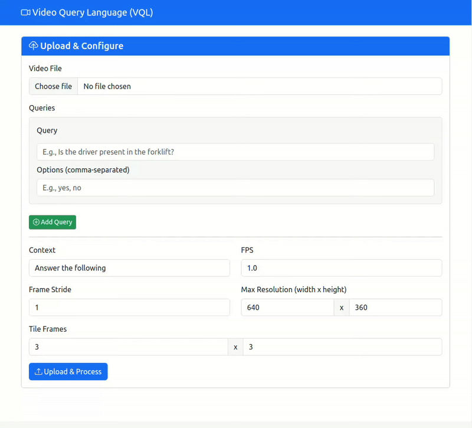

# VQL: Video Query Language

Searching through video data by asking the right questions.

Step 1: Enter your questions and upload your video. Say you want to analyze dashcam footage of your forklift. You want to know when your driver was in and out of the vehicle, when the forklift was carrying a payload and where the forklift has been.



Step 2: Query the video for specific scenarios. Say you want to find all the sceanrios where: the forklift is carrying a paylaod AND when it is loading the truck.


# Example usage

Here we will be running VQL on a forklift POV to assess its utilization. Say we want to catch the frequency at which the driver is not present at the forklift:


| Frame | Timestamp | Image |
|-------|-----------|-------|
| 0423 | 409.31s |  |
| 0468 | 452.85s |  |
| 0693 | 670.57s |  |

`default_config.yaml`: Frame your list of queryies along with their options. Also specify other hyperparameters.
```
queries:
  - query: "Is the driver present in the forklift?"
    options: ["yes", "no"]
  - query: "Where is the forklift currently at?"
    options: ["Truck", "Warehouse", "Charging"]
  - query: "Is the forklift currently carrying cargo?"
    options: ["yes", "no"]
context: "You are viewing the POV from inside a forklift"
fps: 1.0
tile_frames: [3, 3]
frame_stride: 9
max_resolution: [640, 360]
```

Once you have frames your queries, run the video pre-processing script
```
python main.py --video results/forklift.mp4 --config default_config.yaml --display --save-frames
```

`query.yaml`: Then you may frame your specific query. For example, here we are looking for frames where the truck is being loaded OR the driver is absent from the forklift
```
queries:
  - OR:
    - AND:  # truck is being loaded
      - query: "Is the driver present in the forklift?"
        options: ["yes"]
      - query: "Where is the forklift currently at?"
        options: ["Truck"]
      - query: "Is the forklift currently carrying cargo?"
        options: ["yes"]
    - AND:  # Driver is absent
      - query: "Is the driver present in the forklift?"
        options: ["no"]
      - query: "Where is the forklift currently at?"
        options: ["Truck", "Warehouse"]
      - query: "Is the forklift currently carrying cargo?"
        options: ["yes", "no"]
```

Finally, we can query the video with our VQL search query.
```
python query.py --video results/forklift.mp4 --config default_config.yaml --results results/output.json --query query.yaml
```

First, download the demo video and place it at `results/forklift.mp4`
```
yt-dlp "https://www.youtube.com/watch?v=sRav4EuYFHM&t=493s&ab_channel=Vosty120" -f mp4
```
